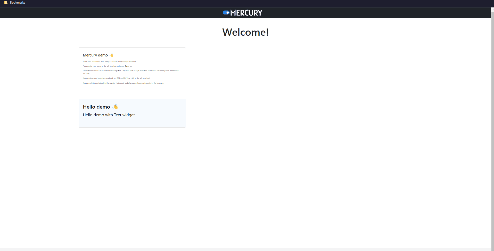

# Jupyter Notebooks Rendered with Mercury on Azure Container Apps 

This is a skeleton repo/template/blueprint that renders runnable, interactive Jupyter Notebooks in the browser using [Mercury](https://github.com/mljar/mercury) via Azure Container Apps.



 It includes:
- **Application code** in the `src/` directory (really just a sample Jupyter Notebook, generated by Mercury)
- **Infrastructure as Code** (in the `/infra` directory), written in Bicep, that provision Azure resources and specify how to deploy the code on Azure

## Prerequisites
- [Azure Developer CLI](https://learn.microsoft.com/azure/developer/azure-developer-cli/install-azd)
- [Python (3.9+)](https://www.python.org/downloads/)
- [Docker](https://docs.docker.com/get-docker/)

## Quickstart

The fastest way for you to get this application up and running on Azure is to use the `azd up` command. This single command will create and configure all necessary Azure resources - including access policies and roles for your account and service-to-service communication with Managed Identities.

1. Open a terminal, create a new empty folder, and change into it.
2. Create a new Python virtual environment (optional but **highly** recommended)
3. Run the following command to initialize the project, provision Azure resources, and deploy the application code.

```
azd init --template savannahostrowski/jupyter-mercury-aca
azd up
```

At the end of this step, you'll be able to visit a URL to see the web app + the Jupyter notebooks in `src/`.

## How to modify this template to make it your own!
In the `src/` directory, you'll find a sample notebook generated by Mercury. You can remove this file and replace it with your own Jupyter notebook(s). Remember to `pip install` the Python package dependencies for any notebooks you add to the app and `pip freeze > requirements.txt` to save the deps (this is important for installing the deps in the container)! Whenever, you're ready, re-run `azd deploy` to redeploy the code to the resources on Azure!

## Don't have an Azure subscription?
In order to use this template, you'll need an Azure subscription. If you don't already have one, you can sign up for a [free account here](https://azure.microsoft.com/free/).


## Other resources
- More about the Azure Developer CLI - [aka.ms/azd](aka.ms/azd)
- Find other templates on the Azure Developer CLI template gallery - [aka.ms/awesome-azd](aka.ms/awesome-azd)
