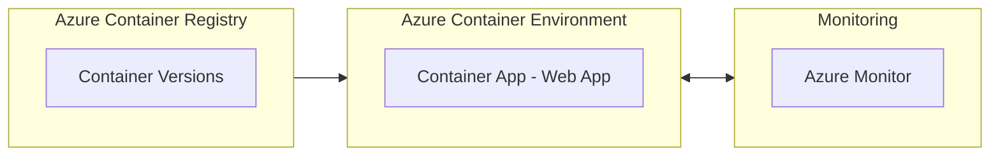

# Jupyter Notebooks Rendered with Mercury on Azure Container Apps (an Azure Developer CLI (`azd`) template)

This is an Azure Developer CLI (azd) template that renders runnable, interactive Jupyter Notebooks in the browser using [Mercury](https://github.com/mljar/mercury). This template uses Azure Container Apps to host the application on Azure. It includes:
- **Application code** in the `src/` directory (really just a sample Jupyter Notebook, generated by Mercury)
- **Infrastructure as Code** (in the `/infra` directory), written in Bicep, that provision Azure resources and specify how to deploy the code on Azure
- **A GitHub Actions workflow** that sets up a CI/CD pipeline to run against real Azure resources on every commit to your repo (in the `.github/` directory)
- **VS Code configuration** to run and debug the application (in the `.vscode/` directory)

## Prerequisites
- [Azure Developer CLI](https://learn.microsoft.com/azure/developer/azure-developer-cli/install-azd)
- [Python (3.9+)](https://www.python.org/downloads/)
- [Docker](https://docs.docker.com/get-docker/)

## Quickstart

The fastest way for you to get this application up and running on Azure is to use the `azd up` command. This single command will create and configure all necessary Azure resources - including access policies and roles for your account and service-to-service communication with Managed Identities.

1. Open a terminal, create a new empty folder, and change into it.
2. Create a new Python virtual environment.
3. Run the following command to initialize the project, provision Azure resources, and deploy the application code.

```
azd up --template savannahostrowski/python-mercury-notebooks-azd
```

## How to modify this template
In the `src/` directory, you'll find a sample notebook generated by Mercury. You can remove this file and replace it with your own Jupyter notebook(s). Remember to `pip install` the Python package dependencies for any notebooks you add to the app! Whenever, you're ready, re-run `azd up`!

## Architecture
This app uses the following Azure resources:

- [**Azure Container Apps**](https://docs.microsoft.com/azure/container-apps/) to host the Web frontend and API backend
- [**Azure Monitor**](https://docs.microsoft.com/azure/azure-monitor/) for monitoring and logging
- [**Azure Key Vault**](https://docs.microsoft.com/azure/key-vault/) for securing secrets

In order to use this template, you'll need an Azure subscription. If you don't already have one, you can sign up for a [free account here](https://azure.microsoft.com/free/).




## Other resources
- More about the Azure Developer CLI - [aka.ms/azd](aka.ms/azd)
- Find other templates on the Azure Developer CLI template gallery - [aka.ms/awesome-azd](aka.ms/awesome-azd)